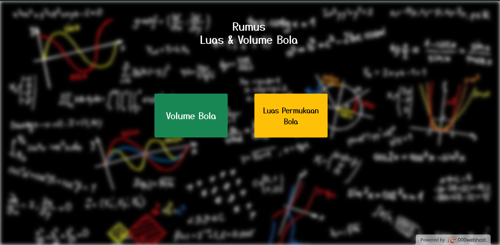
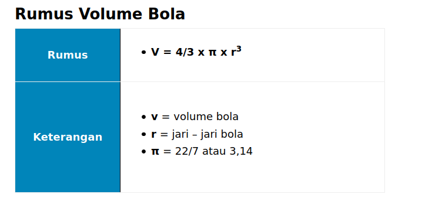
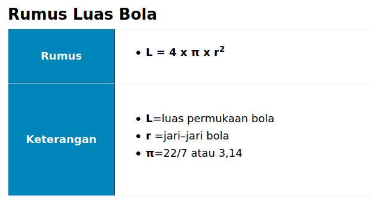

<h1>Rumus Chalange 4 Adisutjipto Linux Comunity</h1>

Tampilan Website

Rumus Volume Bola
 

Rumus Luas Bola
 

Hal terpenting dalam aplikasi ini ialah pada saat kita merubah rumus tersebut menjadi sebuah code PHP
berikut source code PHP untuk menghitung Volume bola dan Luas Permukaan Bola

 
Volume Bola
 
<blockquote>
  //Volume Bola
  
   if ($phi == '3.14') {
        $ops1 = 4 * 3.14 * pow($r, 3);
        $volume = $ops1 / 3;
        $notif = 'on';
    } else {
        $ops1 = 22 * pow($r, 3) / 7;
        $volume = 4 * $ops1 / 3;
        $notif = 'on';
    }
  </blockquote>
  
 
Luas Permukaan Bola
 
<blockquote>
  //Rumus Luas Permukaan Bola
  
 if ($phi == '3.14') {
        $luas = 4 * 3.14 * pow($r, 2);
        $notif = 'on';
    } else {
        $ops1 = 22 * pow($r, 2) / 7;
        $luas = 4 * $ops1;
        $notif = 'on';
    }
  </blockquote>

 Cara Dwonload Source Code

<ul>
  <li>
    1. Install menggunakan Git
    
    <blockquote> $ git clone git://github.com/Nofrisdan/Chalange4_linuxRUMUS </blockquote>
   </li>
   <li>
      2. Install menggunakan link github
  <blockquote> https://github.com/Nofrisdan/Chalange4_linuxRUMUS </blockquote>
  </li>
</ul>

 Coba aplikasinya dengan mengunjungi link berikut 

 <blockquote> https://nofrisdanstta.000webhostapp.com/ </blockquote>
